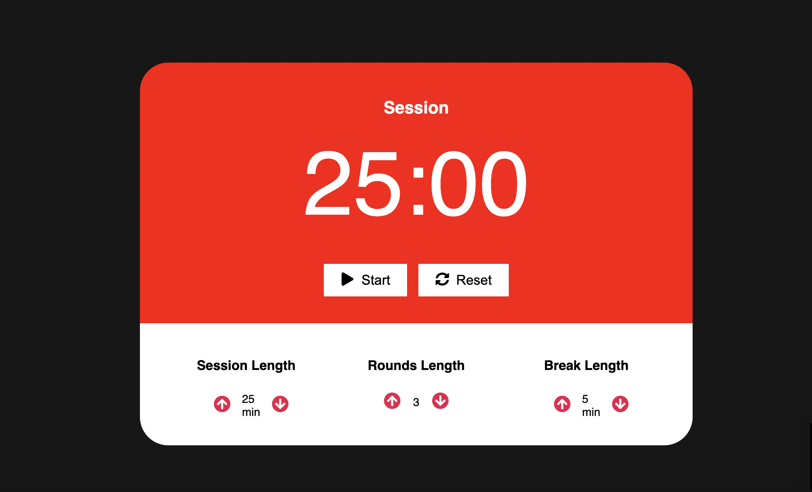
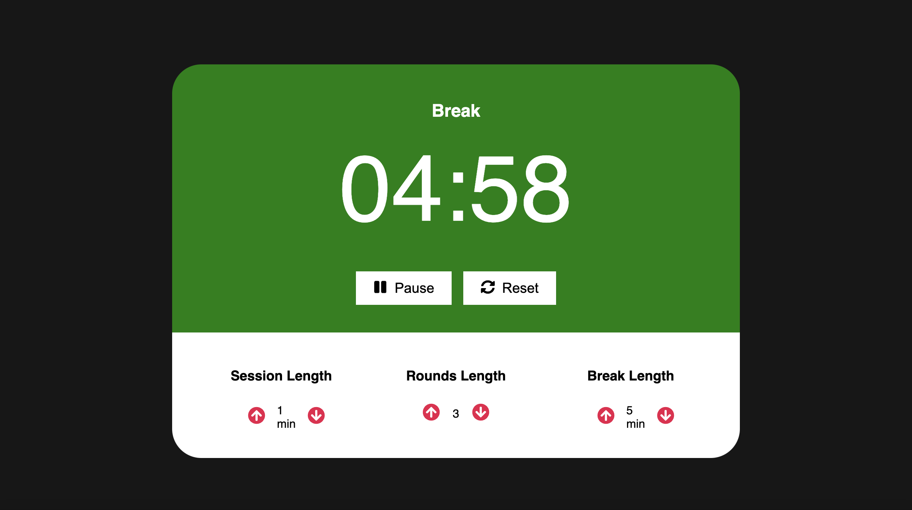

# Pomodoro Timer

This is time management technique. The technique involves increasing work efficiency with less time spent due to deep concentration and short breaks. In the classical technique time segments - "pomodoros" last half an hour: 25 minutes of work and 5 minutes of rest.


     


### Start

```shell
npm run start
```

**Stacks:** HTML, CSS, JS, ReactJS, Redux, Redux-thunk, Webpack
